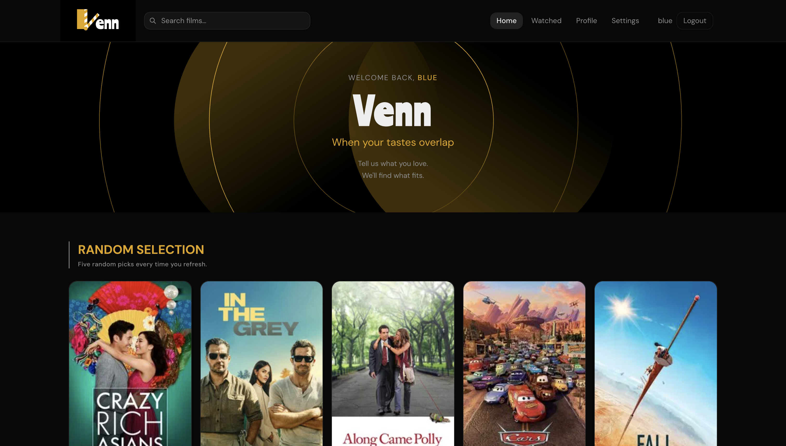
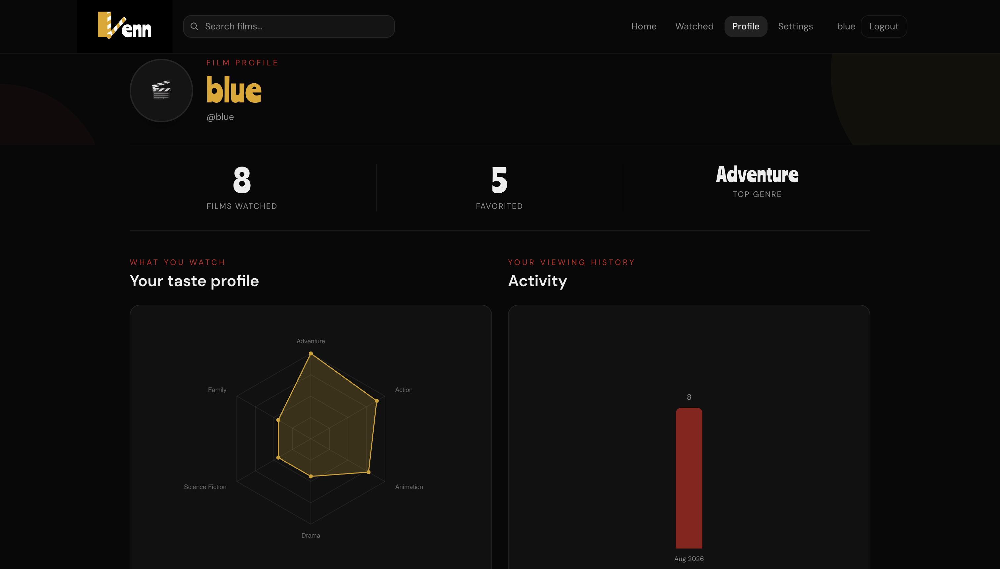
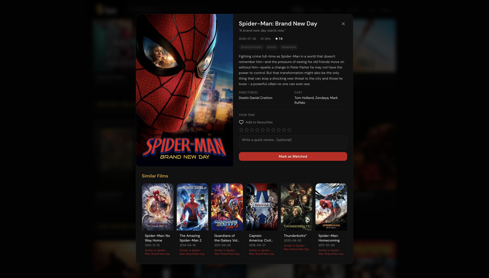
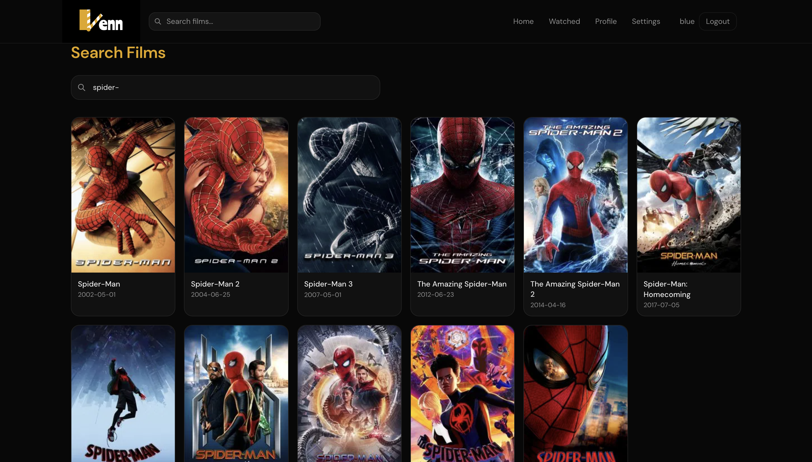
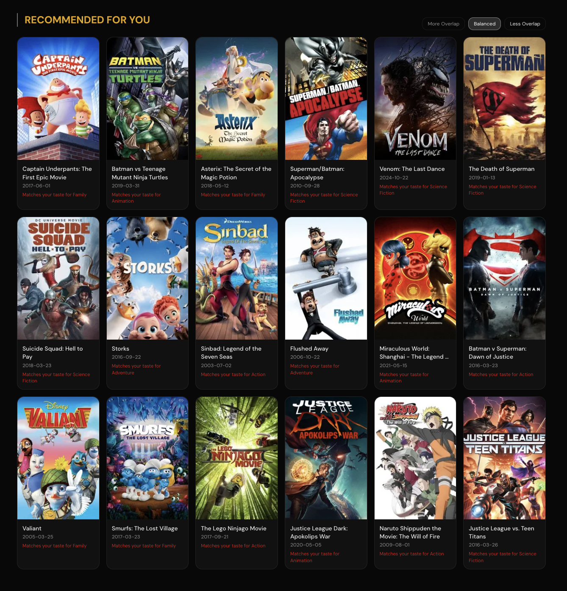
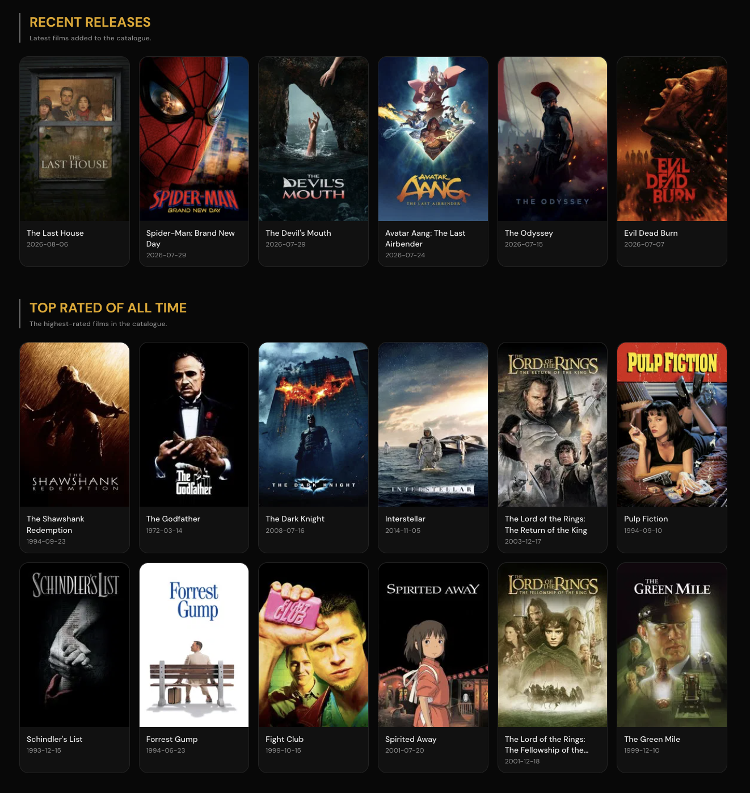
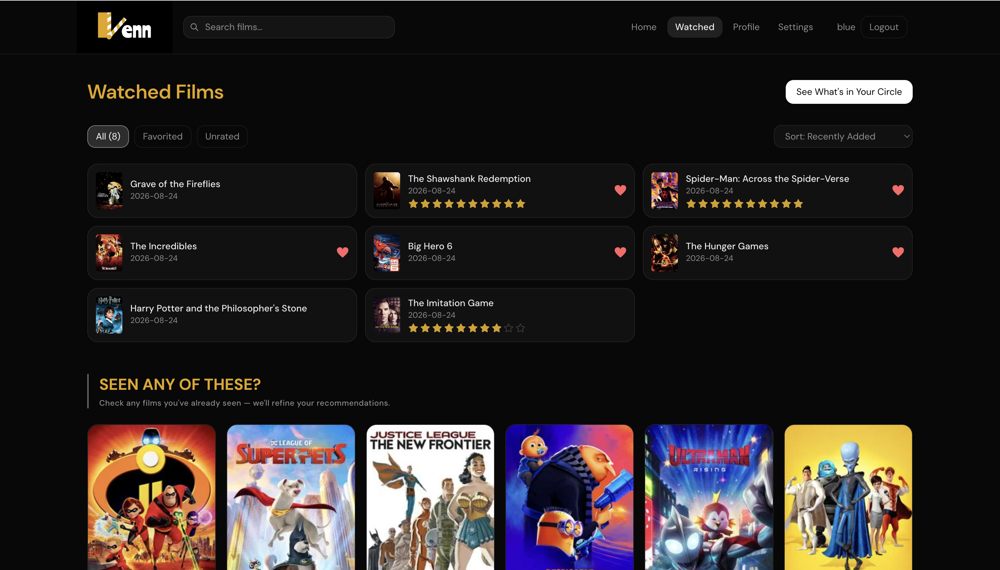

#  Mindi's Venn

**When your tastes overlap ✶⋆.˚**

Venn is a full-stack movie recommendation platform that builds a personalized taste profile from the films you love and surfaces recommendations you can actually understand.

I wanted to practice taking ML beyond a Jupyter notebook and integrating it into a real, full-stack application.
I also wanted to build something around a problem I'd personally noticed while using movie recommendation websites. Most recommendation systems are focused on answering:

> **"What movie should the user watch next?"**

But sometimes I wanted the opposite: **"What movies have I probably already seen?"**

Existing movie sites made it surprisingly difficult to intentionally find and confirm movies I'd already watched. That became the idea behind **What's in Your Circle** — a separate similarity system designed to surface movies I was likely already familiar with, making it possible to quickly confirm them instead of searching for each one individually.

Venn became a project where I could combine ML, backend development, frontend engineering, and UI/UX design while solving a problem I actually encountered.

**Try it out! ➛** [venn-movies.vercel.app](https://venn-movies.vercel.app/)

## Screenshots

| Homepage | Profile |
|:---:|:---:|
|  |  |
| **Movie Modal** | **Search** |
|  |  |
| **Recommendations** | **Selection** |
|  |  |
| **Watched** | |
|  | |

## What it does

- **Cold-start onboarding** — new users pick 5–10 films they've genuinely enjoyed. No waiting around for weeks of "watch history" to accumulate before recommendations feel personal.
- **"What's in your circle"** — on the Watched page, a dedicated section looks at everything you've marked as watched and surfaces other films you've probably already seen, so you can batch-confirm them as watched in a couple of taps instead of hunting them down one search at a time.
- **Explainable recommendations** — every suggested film comes with a short reason ("Matches your taste for Neo-noir") instead of a black-box score.
- **Adjustable overlap** — a *Tight / Balanced / Loose* control lets you dial recommendations from close matches to more adventurous, further-out picks.
- **Taste-aware dashboard** — random daily picks, recent releases, and all-time top-rated films, all aware of what you've already marked as watched or liked.
- **Watched, tracked, remembered** — mark films as watched/liked and add a review! Your recommendations adjust in response.
---

## Tech stack

| Layer | Tools |
|---|---|
| **Frontend** | React + TypeScript, Tailwind CSS, Vite, deployed on Vercel |
| **Backend** | FastAPI + Uvicorn, deployed on Render |
| **Auth & data** | Supabase |
| **ML** | Python, scikit-learn, pandas, numpy, joblib |
| **Movie data** | TMDB + IMDb ([Kaggle dataset](https://www.kaggle.com/datasets/alanvourch/tmdb-movies-daily-updates)), TMDB live API for posters |
| **Design** | Figma, custom Lottie animations |

---

## Design & UI

The majority of Venn's UI was designed and prototyped in **Figma Make** before being implemented in React. I used the designs as a starting point for the frontend while refining interactions and responsive behavior during implementation.

The loading animations and other motion elements were **custom-designed in Figma** and integrated into the application as Lottie animations.

---

## How the recommendations work

Venn's recommendation engine runs on content-based filtering over a curated catalogue rather than raw popularity or collaborative filtering.

### Cutting ~1M movies down to ~7,000 with Bayesian filtering

The raw TMDB/IMDb dataset starts at roughly a million entries — the overwhelming majority with a handful of votes and no reliable signal on quality. Sorting by raw average rating alone breaks down immediately: a movie with five 10/10 votes would outrank a beloved classic with 50,000 votes averaging 8.5.

To fix that, every film is scored with **IMDb's Bayesian Weighted Rating** formula:

```
WR = (v ÷ (v + m)) × R + (m ÷ (v + m)) × C
```
- `v` — the film's vote count
- `R` — the film's raw average rating
- `C` — the mean rating across the entire dataset
- `m` — a tunable "trust threshold" (set to **700** here) — the minimum vote count a film needs before its own rating is trusted more than the dataset average

In practice, this pulls low-vote-count films toward the dataset mean (so a 10/10 with 3 votes doesn't outrank a 7.5/10 with 50,000 votes) while letting well-vetted films rise on their actual merits. Films are then filtered to a `WR` score ≥ 4.1, capped at the top 15,000 by score, and stripped of any missing overview/cast/director/poster data — landing at a final catalogue of **6,987 films**. Small and curated beats large and noisy for a recommendation system: every film in the dataset is one worth recommending.

### Diversity controls

Recommendations cap franchise entries (max 2 per franchise in the top 150 candidates) and mix in "serendipity" picks drawn from similarity ranks 50–100, so results don't collapse into an echo chamber of near-identical sequels.

### Adjustable overlap: Tight / Balanced / Loose

Rather than re-scoring anything, this control changes *which slice of the already-ranked candidate list* gets pulled from — candidates are sorted by cosine similarity to your taste profile, then a rank-range window is selected from that sorted list:

```python
OVERLAP_PRESETS = {
    "tight": (0, 70),      # only the most tightly-aligned matches
    "normal": (50, 250),   # current default behavior
    "loose": (100, 400),   # skip the closest matches, pull from a wider, looser pool
}
```
### "What's in your circle" — a second, purpose-built similarity model

The batch-confirmation flow on the Watched page runs on its own blend, tuned differently from the main cold-start/dashboard engine since the goal here is different: not "discover something new," but "surface what you've very likely already seen." It combines two similarity signals:

- **60% keyword similarity** — a separate binary keyword vector space (built independently from the main tags vectorizer)
- **40% general content similarity** — the same overview/genre/cast/director vectors used elsewhere

That keyword-heavy blend is deliberate — keyword overlap is a stronger "you've probably seen this too" signal than broad genre similarity for a same-universe or same-franchise style match. Results are also capped per-director (max 3 per director) rather than per-franchise, since the goal is catching everything from a director or series you've been working through, not enforcing variety.

### On-demand similarity, not a precomputed matrix

Rather than shipping a precomputed similarity matrix (~130MB), Venn stores lightweight feature vectors and computes cosine similarity on demand at request time. This keeps the deployed backend under 2MB while still delivering fast, personalized results — and posters are fetched live from the TMDB API at runtime, so the core recommendation logic never depends on a network call.

---

## Deployment notes

- Frontend deploys to **Vercel** on push.
- Backend deploys to **Render's** free tier, which spins down after ~15 minutes of inactivity. A scheduled GitHub Actions workflow pings the backend's `/health` endpoint every 10 minutes to keep it warm; a full-screen loading state also gracefully handles any cold starts that slip through.

---

## Credits

Movie data provided by [TMDB](https://www.themoviedb.org) and [IMDb](https://www.imdb.com). 

---

Built as a portfolio project to demonstrate end-to-end ML, backend, and frontend engineering.
